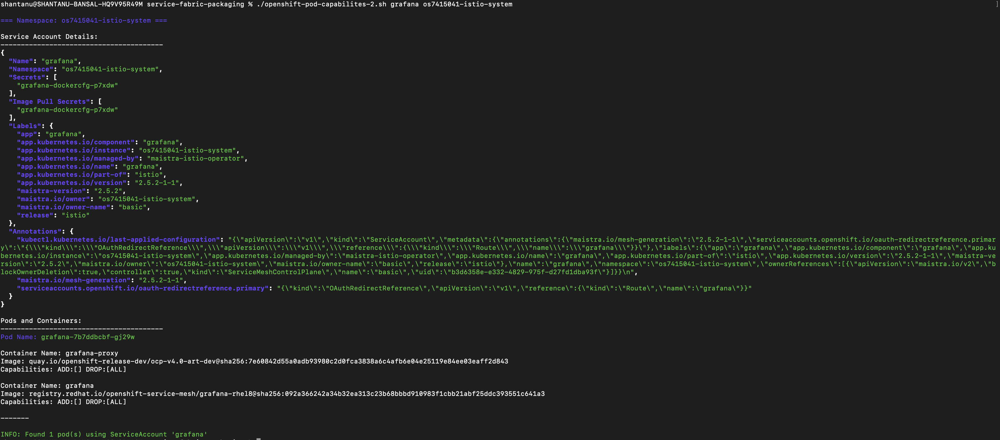

## Script to find out the pods and its capabilities using a particular service account.

### How to use?

#### For particular namespace.

`./openshift-sa-pod-capabilities.sh <service-account-name> <namespace>`

Example:

`./openshift-sa-pod-capabilities.sh grafana os7415041-istio-system`

#### Across All namespaces

`./openshift-sa-pod-capabilities.sh <service-account-name>`

Example:

` ./openshift-sa-pod-capabilities.sh grafana`

